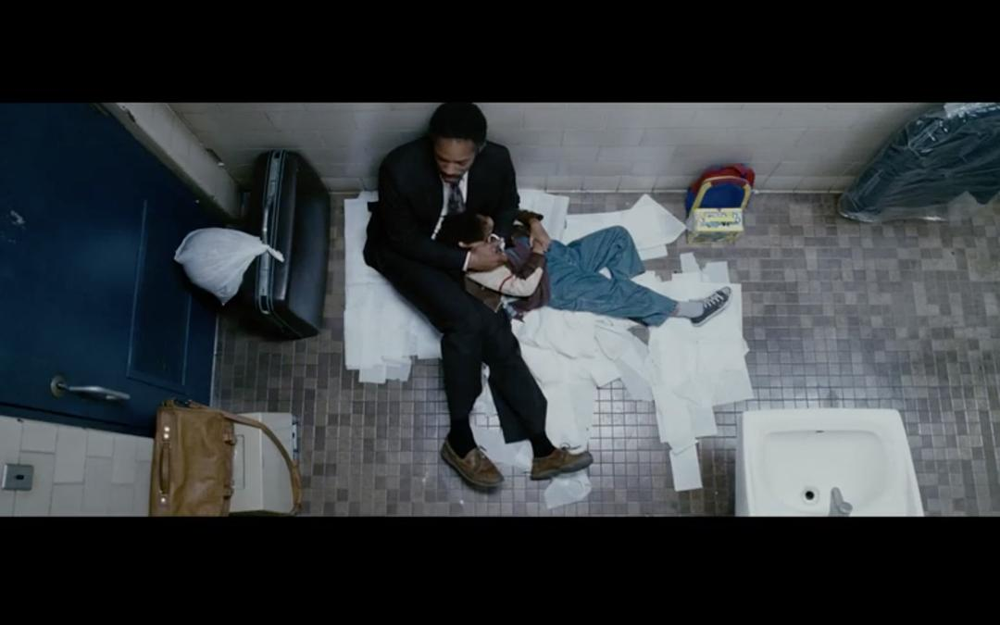
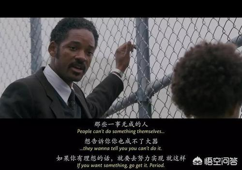
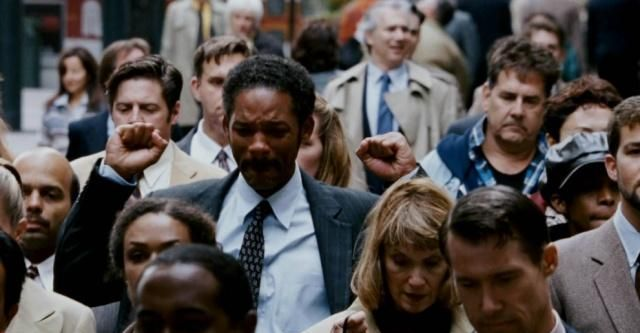
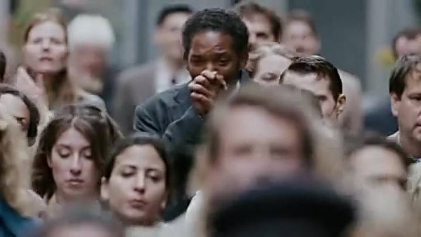

# 当幸福来敲门观后感

1. **带有“励志”意味的电影，往往带有一种“鼓舞人”的力量。**

   

2. **而在电影主人公实现梦想时，情感脉络也冲向高潮，观众也能在这样的时刻收获一份“燃”的感觉。**

《当幸福来敲门》就是这样的电影

[当幸福来敲门在线观看HD免费观看完整版侠客电影网](http://www.9do9.com/?m=vod-detail-id-58026.html)

*还能说些什么才最能描述好威尔·史密斯抱着孩子藏在地铁厕所里度过那一晚的内心感受呢？无论如何，当我们设身处地的试着去感受时，便会发现其中的不易以及做到之后的某种伟大。*

~~贯穿影片始终的，都是一种坚韧不拔的意志。~~

- * * * 史密斯奉献了比他以往硬汉形象更加硬汉的表演，这种对生活阻碍的不屈，以及对新生活的努力奋斗，极易打动人。

- [ ] 而当他最终收获成功时，所有辛苦换来的喜悦也会让观众激动与感动。

- [x] 我很喜欢史密斯在所有奔跑的镜头，令人振奋。

最让人感动的是片尾，史密斯走在人群中想要欢呼却又克制的画面，所有的情绪都蕴含在了喜悦的泪水中。

<u>最令人惊叹的是，影片主人公加德纳是有真实原型的——现实中的加德纳的确坚韧努力，并获取了很了不起的成就</u>

`看完电影，就会想到这样一句话：`

”既然知道了自己要往哪个方向走，那就不用太在意走多久、走得是不是舒服了，只管坚定走下去就好。“

> 正在经历生活阻碍的人们，不要轻易放弃，不要丢失信心，继续努力吧，幸福会来敲门的。

| 名称           | 国籍 | 时间 | 评分 |
| -------------- | ---- | ---- | ---- |
| 《当幸福来敲门 | 美国 | 2008 | 9.3  |

